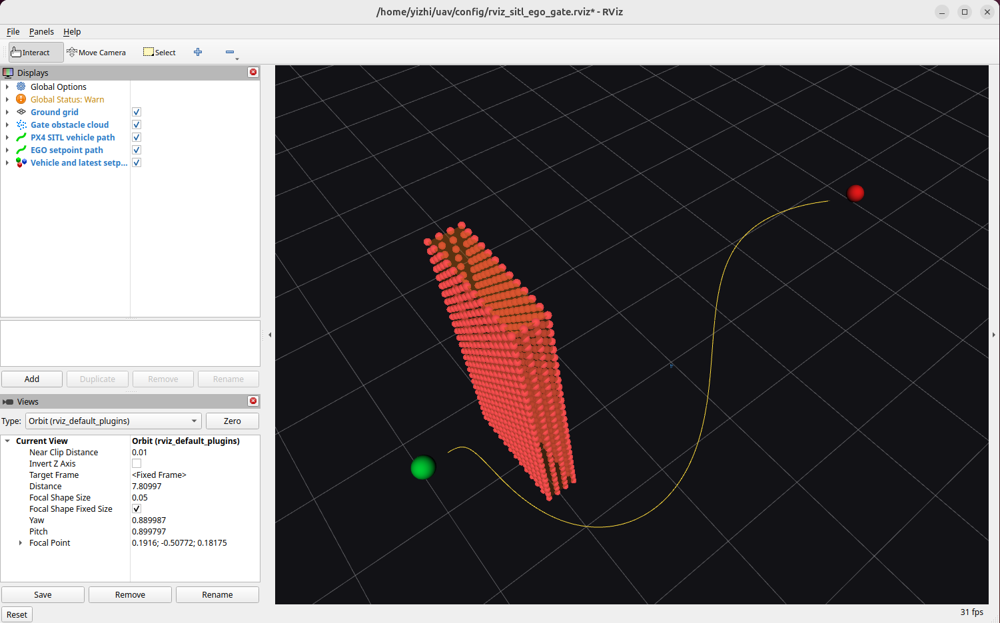

# PX4 SITL + ROS2 EGO-Planner 避障闭环项目

这是一个无人机软件在环（SITL）闭环项目，用来验证 Gazebo、PX4 SITL、uXRCE-DDS、ROS2 和 EGO-Planner 能否组成一条完整的规划控制链路。

整体链路如下：

```text
Gazebo 仿真无人机、传感器、障碍物
        -> PX4 SITL 运行飞控逻辑
        -> uXRCE-DDS 桥接 PX4 uORB 消息到 ROS2
        -> ROS2 发布里程计和障碍物点云
        -> EGO-Planner 生成 B-spline 轨迹
        -> ROS2 发布 /fmu/in/trajectory_setpoint
        -> PX4 控制 Gazebo 中的无人机运动
```

## 项目结果

最终验证场景是一堵墙放在起点和终点之间：

- 起点：`(3, 0, 1)`，ROS/ENU 坐标系
- 终点：`(-3, 0, 1)`，ROS/ENU 坐标系
- 墙中心：`(2, 0, 1.45)`
- 原始墙体范围：`x=[1.85, 2.15]`，`y=[-0.6, 0.6]`，`z=[0.2, 2.8]`
- 膨胀后的安全边界约为：`x=[1.751, 2.249]`，`y=[-0.699, 0.699]`，`z=[0.1, 2.9]`

RViz 成功截图：



B-spline 采样验收结果见 [evidence/single_wall_x2_start3_goalneg3_sampling.txt](evidence/single_wall_x2_start3_goalneg3_sampling.txt)：

```text
samples_inside_inflated_wall: 0
min_abs_y_when_x_in_wall_band: 1.302
passed: True
```

PX4 Offboard 闭环证据见 [evidence/offboard_closed_loop_summary.json](evidence/offboard_closed_loop_summary.json)。该文件记录了 ROS2 真实向 SITL 的 `/fmu/in/trajectory_setpoint` 发布 setpoint，PX4 进入 armed / Offboard 状态，并驱动 Gazebo 中的无人机产生位移。

## 目录结构

```text
config/
  advanced_param.launch.py          # 支持 obstacles_inflation 和 lambda_fitness 参数的 EGO launch 文件
  single_wall.sdf                   # 单墙 Gazebo world
docs/
  RUNBOOK.md                        # 复现实验命令和通过标准
  INTERVIEW_NOTES.md                # 面试讲解笔记
evidence/
  offboard_closed_loop_summary.json
  single_wall_x2_start3_goalneg3_bspline.yaml
  single_wall_x2_start3_goalneg3_sampling.txt
  rviz_sitl_ego_avoidance_success.png
scripts/
  sitl_vehicle_local_position_to_odom.py
  sitl_virtual_obstacle_cloud.py
  ros2_pos_cmd_tcp_sender.py
  px4_sitl_ego_command_bridge.py
  publish_bspline_path_for_rviz.py
  sitl_gcs_heartbeat.py
  sitl_real_offboard_square.py
```

## 已验证内容

- PX4 SITL 和 Gazebo 可以运行 x500 仿真无人机。
- uXRCE-DDS 可以把 PX4 `/fmu/out/*` 和 `/fmu/in/*` 话题暴露到 ROS2。
- `/fmu/out/vehicle_local_position` 可以从 PX4 NED 坐标转换成 ROS ENU `nav_msgs/Odometry`。
- 虚拟单墙障碍物可以作为 `sensor_msgs/PointCloud2` 发布给 EGO-Planner。
- EGO-Planner 可以读取 odometry 和 obstacle cloud，并输出 B-spline 轨迹。
- 轨迹采样点没有进入膨胀墙体，说明规划结果绕过了障碍物。
- EGO 的 `PositionCommand` 可以桥接成 PX4 `/fmu/in/trajectory_setpoint`。
- PX4 可以进入 Offboard / armed 状态，并在 Gazebo 中控制无人机运动。

## 安全边界

本仓库只面向 SITL。命令桥 `px4_sitl_ego_command_bridge.py` 默认拒绝发布 `/fmu/in/*`，除非显式设置：

```bash
ALLOW_SITL_EGO_OFFBOARD=YES
```

同时脚本会检查是否存在真实 Pixhawk 串口 uXRCE-DDS Agent，避免误把 SITL 命令发到真实飞控。不要直接把本仓库用于真机飞行；真机需要单独做硬件安全审查、失控保护和场地验证。

## 为什么需要障碍物膨胀

EGO-Planner 规划的是无人机质心轨迹，但真实四旋翼有机体半径、定位误差和轨迹跟踪误差。因此不能只把障碍物原始点云当作边界，而要在占据栅格地图里做膨胀，参数是：

```text
grid_map/obstacles_inflation
```

如果点云太稀疏，或者膨胀半径太小，规划器可能从点云缝隙中穿过去；如果膨胀太大，狭窄通道又可能被完全堵死。

本项目最终验证中：

- 原始墙体：`y=[-0.6, 0.6]`
- 膨胀墙体：约 `y=[-0.699, 0.699]`
- 轨迹经过墙的 x 范围时，最近点 `|y|=1.302`

因此轨迹与膨胀墙体之间仍有明显安全间隔。
