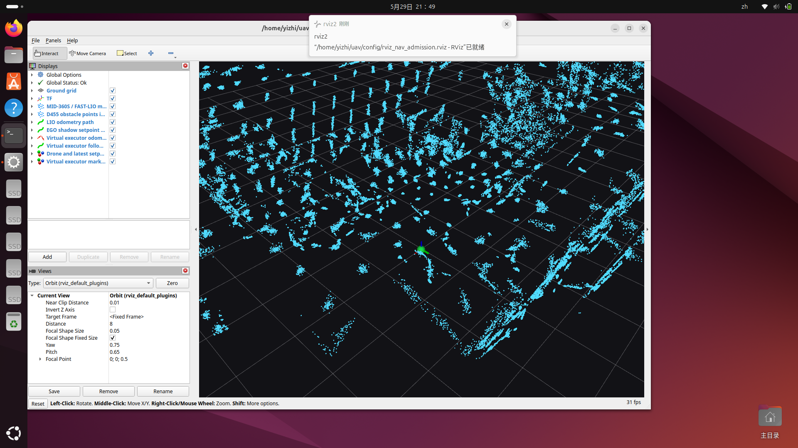

# FAST-LIO2 LiDAR+IMU Rosbag 离线 SIL 复现手册

本文档用于复现 MID360S LiDAR + IMU rosbag 离线验证 FAST-LIO2 的流程。它验证的是定位和建图链路，不是 PX4 Offboard 闭环，不发送 arm / takeoff / offboard 指令，也不修改 PX4 源码。

核心链路：

```text
MID360S 原始点云 + IMU
  -> ros2 bag record / ros2 bag play
  -> FAST-LIO2
  -> /Odometry + /path + /cloud_registered + /tf
  -> RViz + topic / timestamp / frame / TF / 连续性检查
```

## 1. 运行前提

已验证机器环境见 [ENVIRONMENT.md](ENVIRONMENT.md)。FAST-LIO2 离线验证额外需要：

- ROS2 Jazzy。
- `livox_ros_driver2` 工作空间可被当前 shell source。
- FAST-LIO2 ROS2 包名为 `fast_lio`，可运行 `mapping.launch.py`。
- MID360S driver 发布：
  - `/livox/lidar`，类型 `livox_ros_driver2/msg/CustomMsg`
  - `/livox/imu`，类型 `sensor_msgs/msg/Imu`
- FAST-LIO2 配置参考 [config/fast_lio_mid360s.example.yaml](../config/fast_lio_mid360s.example.yaml)。

仓库不提交 `.mcap` / `.db3` rosbag 大文件。复现者需要自己录包，或者把已有 bag 放到自己的机器上。

## 2. 检查 ROS 包是否可见

```bash
source /opt/ros/jazzy/setup.bash
source ~/drone_ws/livox_ws_20260524/install/setup.bash
source ~/drone_ws/lio_ws_20260524/install/setup.bash
ros2 pkg prefix livox_ros_driver2
ros2 pkg prefix fast_lio
```

为什么跑：先确认 ROS2 环境能找到 Livox driver 和 FAST-LIO2。

通过标准：两个 `ros2 pkg prefix` 都输出 install 路径。

失败说明：workspace 没 source、包没编译，或包名不一致。

面试怎么讲：启动节点前先确认包可见，避免把环境问题误判为传感器或算法问题。

## 3. 检查 MID360S 原始 topic

启动 Livox driver。具体启动方式取决于你的 `livox_ros_driver2` 配置；本项目当时使用的核心命令等价于：

```bash
ros2 run livox_ros_driver2 livox_ros_driver2_node --ros-args \
  -p xfer_format:=1 \
  -p multi_topic:=0 \
  -p data_src:=0 \
  -p publish_freq:=10.0 \
  -p output_data_type:=0 \
  -p frame_id:=livox_frame \
  -p user_config_path:=/path/to/livox_mid360s_driver.local.json
```

检查 topic 是否存在：

```bash
ros2 topic list | grep livox
```

检查频率：

```bash
timeout 8s ros2 topic hz /livox/imu
timeout 8s ros2 topic hz /livox/lidar
```

通过标准：

- `/livox/imu` 存在，并且约 `200 Hz`。
- `/livox/lidar` 存在，并且约 `10 Hz`。

失败说明：

- topic 不存在：driver 没启动、传感器没上电、网络/IP/配置不对。
- topic 存在但没有频率：topic 名字被注册了，但没有真实数据流。

面试怎么讲：`topic list` 只能说明 topic 存在，`topic hz` 才说明数据连续。

## 4. 录制 LiDAR+IMU 原始 bag

录包命令：

```bash
export BAGDIR=~/drone_ws/bags
timeout --signal=INT 20s ros2 bag record \
  -o "$BAGDIR/mid360s_livox_only_$(date +%Y%m%d_%H%M%S)" \
  /livox/lidar /livox/imu
```

录制动作建议：

- 前 3 秒静止。
- 中间 12-15 秒低速移动或轻微转向。
- 最后 2-3 秒静止。
- 尽量让雷达看到墙、门框、桌腿、走廊边缘等几何结构。
- 不要剧烈甩动、快速旋转、遮挡雷达，或一直对着纯白墙。

为什么跑：录的是 FAST-LIO2 的原始输入，不是算法输出。后续用同一个 bag 可以重复回放和调参。

通过标准：录包结束后目录中有 `metadata.yaml` 和 `.mcap` 或 `.db3`。

失败说明：没有 `metadata.yaml` 代表 bag 没正常收尾，不能当作可复现证据。

## 5. 检查 bag 内容

```bash
ros2 bag info /path/to/mid360s_livox_only_YYYYMMDD_HHMMSS
```

通过标准：

```text
Topic: /livox/imu   Type: sensor_msgs/msg/Imu                 Count: > 0
Topic: /livox/lidar Type: livox_ros_driver2/msg/CustomMsg     Count: > 0
Duration: 接近录制时长
```

本项目 2026-05-29 的有效证据包为：

```text
/home/yizhi/drone_ws/bags/mid360s_livox_only_20260529_212055
Duration: 19.514 s
/livox/imu: 3904 messages
/livox/lidar: 196 messages
```

## 6. 停止实时 driver，隔离离线输入

```bash
pkill -INT -f livox_ros_driver2_node
ros2 topic list | grep livox
```

为什么跑：离线验证时不能让实时 driver 和 rosbag 同时发布 `/livox/lidar`、`/livox/imu`，否则 FAST-LIO2 输入不可归因。

通过标准：停止 driver 后，`ros2 topic list | grep livox` 没有输出。

失败说明：如果仍看到 `/livox/*`，还有实时 publisher 或残留节点，需要先清掉。

## 7. 启动 FAST-LIO2

把 [config/fast_lio_mid360s.example.yaml](../config/fast_lio_mid360s.example.yaml) 放到 FAST-LIO2 可读取的位置，然后运行：

```bash
ros2 launch fast_lio mapping.launch.py \
  config_path:=/path/to/config \
  config_file:=fast_lio_mid360s.example.yaml \
  rviz:=false
```

为什么跑：启动 FAST-LIO2，让它等待 `/livox/lidar` 和 `/livox/imu`。

通过标准：日志出现节点初始化完成，例如：

```text
Node init finished.
IMU Initial Done
Initialize the map kdtree
```

失败说明：配置路径、包名、topic 类型或 ROS 环境不对。

## 8. 回放 rosbag

单次回放：

```bash
ros2 bag play /path/to/mid360s_livox_only_YYYYMMDD_HHMMSS --clock
```

为了调试和观察，可以循环回放：

```bash
ros2 bag play /path/to/mid360s_livox_only_YYYYMMDD_HHMMSS --clock --loop
```

注意：`--loop` 会让 bag 时间戳从结尾回到开头。做连续性分析时要区分“循环边界时间回绕”和“单段内时间倒退”。

## 9. 验收 FAST-LIO2 输出

检查 topic：

```bash
ros2 topic list | egrep 'Odometry|path|cloud_registered|tf'
```

检查频率：

```bash
timeout 8s ros2 topic hz /Odometry
timeout 8s ros2 topic hz /path
timeout 8s ros2 topic hz /cloud_registered
```

检查 frame 和 timestamp：

```bash
ros2 topic echo --once /Odometry
ros2 topic echo --once /path
ros2 topic echo --once /cloud_registered --field header
ros2 topic echo --once /tf
```

通过标准：

- `/Odometry` 存在并稳定输出。
- `/path` 存在并输出轨迹。
- `/cloud_registered` 存在并输出局部地图点云。
- `/tf` 有 `camera_init -> body`。
- `frame_id` 一致，典型为 `camera_init`。

## 10. RViz 可视化

可以用本仓库的 RViz 配置：

```bash
rviz2 -d config/rviz_nav_admission.rviz
```

至少应看到：

- Fixed Frame: `camera_init`
- `/cloud_registered` 局部点云地图
- LIO path 或 `/path`
- TF / marker 中的机体位姿

本项目证据截图：



## 11. 本次验证结果摘要

完整报告见 [evidence/fastlio2_sil_validation_20260529.md](../evidence/fastlio2_sil_validation_20260529.md)。

本次 2026-05-29 验证结论：

- rosbag 可正常回放。
- FAST-LIO2 可正常启动。
- 输出 `/Odometry`、`/path`、`/cloud_registered`、`/cloud_registered_body`、`/tf`。
- RViz 可看到局部点云地图和 LIO 轨迹。
- `/Odometry` 约 `10 Hz`，`/path` 约 `1 Hz`，`/cloud_registered` 约 `10 Hz`。
- TF 为 `camera_init -> body`。
- 单段内最大位姿跳变约 `0.0045 m`，未见明显跳变或漂移。
- 该包运动量较小，只能说明低动态/小运动量下稳定，不应夸大为强动态漂移压力测试。

## 12. 面试讲法

可以这样说：

```text
我做的是 FAST-LIO2 的 LiDAR+IMU rosbag 离线 SIL 验证。先确认 MID360S 的 /livox/lidar 和 /livox/imu 频率稳定，再录原始传感器 rosbag。随后停止实时 driver，保证输入只来自 rosbag replay。FAST-LIO2 启动后订阅 bag 回放的点云和 IMU，输出 /Odometry、/path、/cloud_registered 和 camera_init -> body 的 TF。我用 topic hz、timestamp、frame_id、TF、RViz 和轨迹连续性脚本检查输出稳定性。这个阶段不接 PX4，不发任何 arm/takeoff/offboard 指令。
```

必须亲自掌握：

- FAST-LIO2 输入是 LiDAR 点云 + IMU。
- `ros2 bag record` 录原始输入。
- `ros2 bag play` 做离线回放。
- `topic list` 看存在，`topic hz` 看频率。
- `frame_id` 和 TF 决定 RViz 中点云、轨迹、位姿能否对齐。
- 运动量不足时，报告必须如实写限制。
